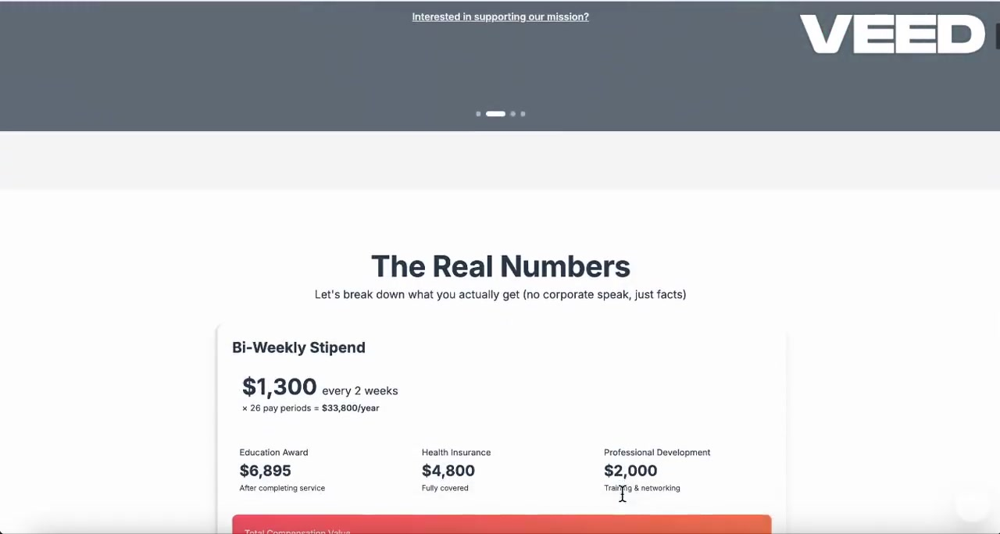

# City Year Bay Area Website

A modern, clean website prototype for City Year Bay Area recruitment, built with React and Tailwind CSS.

## Demo

[](https://github.com/IceyGirl424/braven-city-year-capstone/blob/main/assets/braven-final-demo.mp4)

*Click the image to open the walkthrough video (`assets/braven-final-demo.mp4`).*

[Open demo video](https://github.com/IceyGirl424/braven-city-year-capstone/blob/main/assets/braven-final-demo.mp4)

## Features

- **Clean, Modern Design**: Simplified color palette with uplifting, professional aesthetics
- **Donation Section**: Easy-to-use donation interface with preset and custom amounts
- **Partner Perks**: Highlights networking opportunities, stipends, and leadership experience
- **Interactive Calendar**: Sign up for short shifts (2-4 hours) to experience City Year before committing
- **Video Testimonials**: Placeholder sections for current member and alumni stories
- **Fully Responsive**: Works beautifully on desktop, tablet, and mobile devices

## Getting Started

### Prerequisites

- Node.js (v16 or higher)
- npm or yarn

### Installation

1. Install dependencies:
```bash
npm install
```

2. Start the development server:
```bash
npm run dev
```

3. Open your browser and navigate to `http://localhost:5173`

### Build for Production

```bash
npm run build
```

The built files will be in the `dist` directory.

## Project Structure

```
├── src/
│   ├── components/
│   │   ├── Navbar.jsx          # Navigation bar with smooth scrolling
│   │   ├── Hero.jsx            # Hero section with main CTA
│   │   ├── DonationSection.jsx # Donation interface
│   │   ├── PerksSection.jsx    # Benefits and partner information
│   │   ├── CalendarSection.jsx # Interactive shift signup calendar
│   │   ├── VideosSection.jsx   # Video testimonial placeholders
│   │   ├── ApplySection.jsx    # Application CTA
│   │   └── Footer.jsx          # Footer with links and info
│   ├── App.jsx                 # Main app component
│   ├── main.jsx                # React entry point
│   └── index.css               # Tailwind CSS imports
├── index.html
├── package.json
├── tailwind.config.js          # Tailwind configuration
├── vite.config.js              # Vite configuration
└── README.md
```

## Design Decisions

### Color Palette
- **Primary Red** (`#E63946`): City Year brand color, used for CTAs and highlights
- **Blue** (`#457B9D`): Professional, trustworthy - used in hero and accents
- **Green** (`#06A77D`): Positive, growth - used for available shifts
- **Yellow** (`#FFD166`): Energetic, attention-grabbing - used for perks banner
- **Neutrals**: Clean grays for text and backgrounds

### Key Improvements
1. **Simplified Navigation**: Clean, sticky navbar with smooth scrolling
2. **Clear Messaging**: Emphasizes professional growth and career pathways
3. **Low Commitment Entry**: Calendar allows trying short shifts before full commitment
4. **Visual Hierarchy**: Better spacing, typography, and visual flow
5. **Mobile-First**: Fully responsive design that works on all devices

## Customization

### Adding Real Video Content
Replace the video placeholders in `VideosSection.jsx` with actual video embeds or links.

### Calendar Data
Update the `shiftsData` object in `CalendarSection.jsx` to connect to your actual scheduling system.

### Donation Integration
Connect the donation buttons in `DonationSection.jsx` to your payment processor (Stripe, PayPal, etc.).

## Technologies Used

- **React 18**: Modern React with hooks
- **Tailwind CSS**: Utility-first CSS framework
- **Vite**: Fast build tool and dev server

## License

This project is created for City Year Bay Area.

